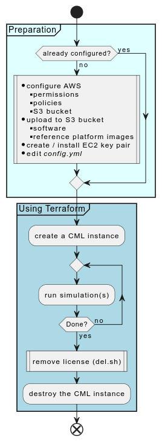
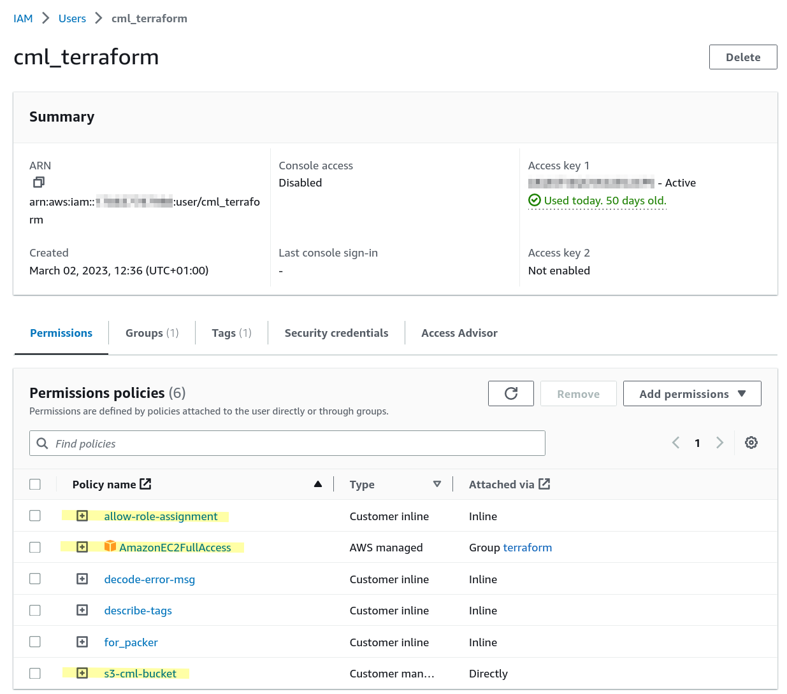
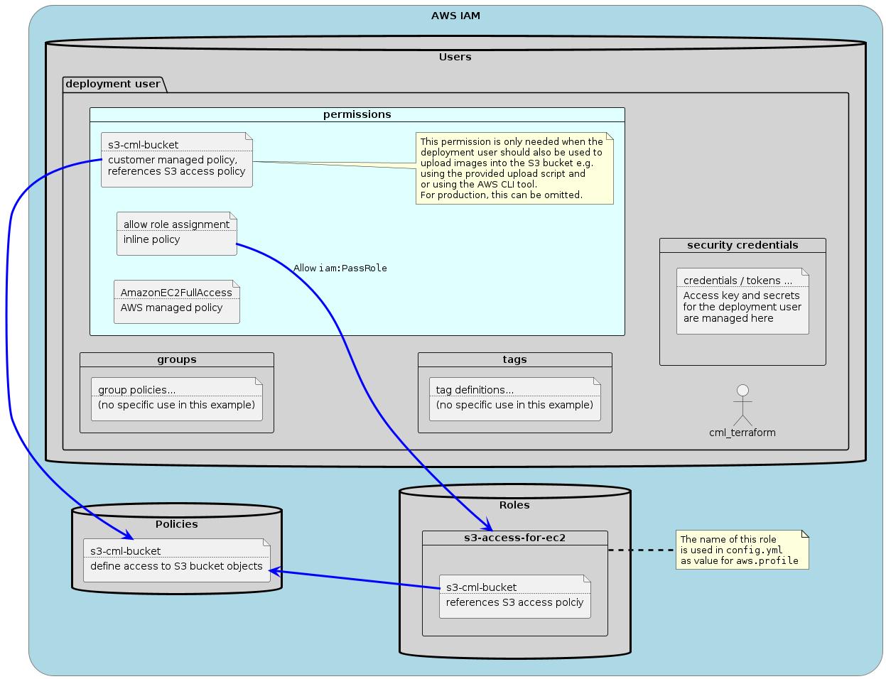

# AWS

This document contains specific configuration steps to deploy a CML instance in AWS. Some sections from the top level document are repeated here with additional detail regarding AWS.

> [!IMPORTANT]
> The repository includes an alternative deployment method for AWS (aws-mini) which does not create any network resources.  It therefore relies on these resources to be available at the time of deploying CML.  See the ["Mini vs regular deployments"](#mini-vs-regular-deployments) section below!

## General requirements

The tooling uses Terraform to deploy CML instances on AWS. It's therefore required to have a functional Terraform installation on the computer where this tool chain should be used.

Furthermore, the user needs to have access to AWS console to create or modify an automation account with the required permissions and policies applied.

In addition, the `upload-images-to-aws.sh` script requires the AWS CLI and the `dialog`utility to upload images to S3. It is a Bash shell script that requires Linux to run.

The AWS CLI and Terraform can be installed on the on-prem CML controller or, when this is undesirable due to support concerns, on a separate Linux instance.

### Preparation

Some of the steps and procedures outlined below are preparation steps and only need to be done once. Those are

- cloning of the repository
- installation of software (Terraform, AWS CLI)
- creating and configuring the AWS automation account, including the creation of associated access credentials
- creating the AWS S3 bucket and uploading images and software into it
- creation of an SSH key pair and installing it into AWS EC2
- editing the `config.yml` configuration file including the selection of an instance flavor, region and other parameters



### Mini vs regular deployments

As mentioned at the top, there's an `aws-mini` deployment option as an alternative to the "regular" deployment option.  The differences are:

| What                                                    | regular flavor | mini flavor |
| ------------------------------------------------------- | -------------- | ----------- |
| Allow CML cluster                                       | yes            | no          |
| Create VPC                                              | optional       | no          |
| Create Subnet, IGW, NAT GW, Route table, security group | yes            | no          |
| Create elastic IP                                       | yes            | optional*   |
| Create VM network interface                             | yes            | yes         |

The mini flavor is useful in case the AWS networking infrastructure is already in place and can not or should not be modified, cloud-cml should simply create a CML instance that uses the existing networking infrastructure by providing the subnet ID and the security group ID that should be used to attach the CML VM to.

If no Elastic IP should be used and the server should use a private IP from the configured subnet instead then this is configurable in the .tf file.  See the comment for the `resource "aws_eip" "server_eip"` inside of `main.tf` for the mini variant.

#### How to enable the mini variant

Edit the `modules/deploy/aws-on.t-f` file and edit the following section:

```hcl
module "aws" {
  #  source  = "./aws-mini"
  source  = "./aws"
  count   = var.cfg.target == "aws" ? 1 : 0
  options = local.options
}
```

So that it reads:

```hcl
module "aws" {
  source  = "./aws-mini"
  # source  = "./aws"
  count   = var.cfg.target == "aws" ? 1 : 0
  options = local.options
}
```

and run the `prepare.sh` script (only when AWS hasn't been selected before, it is selected by default when cloning the repository).

#### Configure the mini variant

Ensure that `aws.subnet_id` and `aws.sg_id`  have valid values and that those resources exist on AWS.

### Terraform installation

Terraform can be downloaded for free from [here](https://developer.hashicorp.com/terraform/downloads). This site has also instructions how to install it on various supported platforms.

Deployments of CML using Terraform were tested using version 1.8.4 on macOS.

```plain
$ terraform version
Terraform v1.8.4
on darwin_arm64
+ provider registry.terraform.io/ciscodevnet/cml2 v0.7.0
+ provider registry.terraform.io/hashicorp/aws v5.51.0
+ provider registry.terraform.io/hashicorp/cloudinit v2.3.4
+ provider registry.terraform.io/hashicorp/random v3.6.1
$
```

It is assumed that the CML cloud repository was cloned to the computer where Terraform was installed. The following command are all executed within the directory that has the cloned repositories. In particular, the top level `README.md`, the `main.tf` and the `config.yml` files, amongst other files.

When installed, run `terraform init` to initialize Terraform. This will download the required providers and create the state files.

### AWS CLI installation

The AWS CLI can be downloaded from [here](https://docs.aws.amazon.com/cli/latest/userguide/getting-started-install.html). This was tested using the following AWS CLI version:

```plain
$ aws --version
aws-cli/2.15.56 Python/3.11.9 Darwin/23.5.0 source/arm64
$
```

### Using a proxy

If you need to use a proxy to access AWS then define it using environment variables. E.g. `export HTTPS_PROXY=http://my.proxy.corp:80/` when using bash.

## AWS requirements

This section describes the resources required by the provisioning scripts to successfully deploy CML on AWS. These configurations and policies need to be created prior to using the tooling. This can be done on the AWS console or via the preferred deployment method (e.g. also via Terraform).

> [!NOTE]
> There's also a [video on YouTube](https://youtu.be/vzgUyO-GQio) which shows all the steps outlined below.

### IAM user and group

A user is needed which can be used by Terraform to deploy the CML instance. It is recommended to also create a group and attach the required policies to the group. A user is then created and assigned to this group in the final step below. This user inherits the policies from the group.

- click "User groups"
- click "Create group"
- enter a name ("terraform")
- click "Create group"

### S3 access / bucket policy

Next, we will create an S3 access policy which is reused to manage the bucket containing the reference platform as well as during CML deployment to allow copying the reference platform images to the EC2 instance.

To create the policy, go to "Policies", then click "Create policy". There select "JSON" instead of "Visual" at the top right and paste the following JSON:

```json
{
    "Version": "2012-10-17",
    "Statement": [
        {
            "Sid": "VisualEditor0",
            "Effect": "Allow",
            "Action": [
                "s3:PutObject",
                "s3:GetObject",
                "s3:ListBucket"
            ],
            "Resource": [
                "arn:aws:s3:::bucket-name",
                "arn:aws:s3:::bucket-name/*"
            ]
        }
    ]
}
```

Replace "bucket-name" to the bucket name of your S3 bucket. This permits Read/Write and List access to the specified bucket and all objects within that bucket.

> [!NOTE]
> This could be further tightened by removing the "PutObject" action from the policy as the EC2 instance / the CML controller only needs read access ("GetObject") and not write access access ("PutObject"). However, to upload images into the bucket, the write access is required at least initially.

Click "Next" and provide a policy name, "cml-s3-access" for example. Finally, click "Create policy".

### AWS KMS policy for EC2

This is an optional policy that can be added to IAM.  This is not covered in the linked video as it was only added and documented with the 0.3.0 release of the tooling.  This works in combination with the `enable_ebs_encryption` attribute in the AWS section of the configuration file.

```plain
{
    "Version": "2012-10-17",
    "Statement": [
        {
            "Sid": "VisualEditor0",
            "Effect": "Allow",
            "Action": [
                "kms:Decrypt",
                "kms:Encrypt",
                "kms:ReEncrypt*",
                "kms:GenerateDataKey*",
                "kms:DescribeKey",
                "kms:CreateGrant"
            ],
            "Resource": "*"
        }
    ]
}
```

For additional information, see this [documentation link](https://docs.aws.amazon.com/autoscaling/ec2/userguide/key-policy-requirements-EBS-encryption.html#policy-example-cmk-access).

Create this policy in the same way as the S3 access policy, name it accordingly as 'cml-kms-access'.  It can be referenced by the cml_terraform user below.  It might be required to limit the resource where this policy should be applied to.  The above example uses a wild-card.

With the default settings on AWS, setting the `enable_ebs_encryption` to true in the aws section of `config.yml`, default KMS keys will be used, so there is no need for an extra IAM policy.

It is required, however, when custom KMS keys are used on AWS; in such a case, the TF user needs to have access to those via IAM policy.

> [!NOTE]
>
> In some companies, EBS encryption might be enforced regardless of whether `enable_ebs_encryption` is set to true.

### Create Role

Now that we have the S3 access policy, we can create a role that uses this policy.

1. go to "Roles"

2. click "Create role"

3. select "AWS service" for the "Trusted entity type" (the default)

4. select "EC2" for the "Use case"

5. click "Next"

6. select the S3 access policy that was created in the previous section ("cml-s3-access") from the permission policy list

7. scroll to the bottom and click "Next"

8. provide a role name, use "s3-access-for-ec2" (this is important to note as this is the policy name that is also referenced in the Terraform configuration to deploy CML and in the inline role assignment). See [here](https://registry.terraform.io/providers/hashicorp/aws/latest/docs/resources/instance), search for `iam_instance_profile`, it says

   > IAM Instance Profile to launch the instance with. Specified as the name of the Instance Profile. Ensure your credentials have the correct permission to assign the instance profile according to the [EC2 documentation](http://docs.aws.amazon.com/IAM/latest/UserGuide/id_roles_use_switch-role-ec2.html#roles-usingrole-ec2instance-permissions), notably `iam:PassRole`.

9. click "Create role" at the bottom right

### Attach policies to user

In the third step we attach permission policies to the group created in the step above. The policies in question are

- AmazonEC2FullAccess, a pre-defined policy that allows to control EC2 instances
- cml-s3-access, the S3 access policies allowing users in this group to read/write/list objects in the bucket specified by the policy
- the "pass role" policy which passes the permission allowing access to the S3 bucket to EC2 instances the users in this group create
- if the KMS access policy has been created and should be used, then attach it to the user as well (optional)

To add these permission follow these steps:

#### EC2 policy

- click on "Add permissions"
- select "Add permissions" from the drop down
- select "Attach policies directly"
- search for "EC2Full" which will result in the "AmazonEC2FullAccess" policy
- select this policy
- click "Next"
- click "Add permissions"

#### S3 access policy

- click on "Add permissions"
- select "Add permissions" from the drop down
- select "Attach policies directly"
- select "Customer managed" in the "Filter by type" drop down
- select the "cml-s3-access" customer managed policy (the one we created above)
- click "Next"
- click "Add permissions"

#### KMS policy (optional)

- click on "Add permissions"
- select "Add permissions" from the drop down
- select "Attach policies directly"
- select "Customer managed" in the "Filter by type" drop down
- select the "cml-kms-access" customer managed policy (the one we created above)
- click "Next"
- click "Add permissions"

#### Pass role policy

- click on "Add permissions"
- select "Create inline policy" from the drop down
- click on "IAM" from the "Select a service" section
- click on the "Write" Access level section
- select the "PassRole" write action
- in the "Resources" section click "Add arn"
- in the dialog "Specify ARNs"
  - click "This account"
  - in the last field, add the "s3-access-for-ec2" policy to the end of the arn. It will look like "arn:aws:iam::111111111111111:role/s3-access-for-ec2" (where the numbers represent your account ID, which is already inserted for you by the UI)
  - click "Add ARN"
- click "Next"
- provide a Policy name, "pass role" works
- click "Create policy"

#### Create user

The final step is to create a user and associate it with the group

- click on "Users"
- click "Add users"
- provide a user name
- click "Next"
- select "Add user to group" (the default)
- select the group previously created ("terraform")
- click "Next"
- click "Create user"

#### Create credentials

The final step is about creating access credentials that can be used with Terraform. We need an access key and a secret key.

- click on "Users"
- select the "cml_terraform" user
- click on the "Security credentials" tab
- scroll down to the "Access keys" section
- click on "Create access key"
- make a note of the access key and the secret key (copy them into an editor so that they can be later used when editing the `config.yml` of the deployment tool)

This access key and the associated secret key must be provided to the AWS Terraform provider via the variables `aws_access_key` and `aws_secret_key`, ideally via environment variables or a vault. See the [Variables section](#terraform-variable-definition) below.

#### Example

The below screen shot shows an example of such a user with the required permission policies highlighted where the name of the user is "cml_terraform". Note that the required permission policies are listed. They are inherited from the "terraform" group. There's also an access key that has been created for this user.



This role that is passed ("s3-access-for-ec2") is then configured in the `config.yml` attribute 'aws.profile'.  The optional "cml-kms-access" policy would show as the fourth line above (not shown in the screen shot), if added.


The following diagram outlines the relation between the various IAM elements:



### Other resources

In addition to the user and group policies set in the previous steps, the following resources for a successful deployment are required.

#### Key name

The key name specifies the name of the SSH key that exists for the EC2 service. A valid SSH key private key must be imported into EC2 and the given name must be referenced within the provisioning HCL.

Key pairs are created locally and the public key is uploaded to EC2

EC2 → Key pairs → Create key pair (choose ED25519 key pair type)

Alternatively, it's also possible to import a public key without exposing the private key via

EC2 → Key pairs → Actions → Import key pair.

Another alternative is to manage keys via the `aws_key_pair` Terraform resource. See the [official documentation](https://registry.terraform.io/providers/hashicorp/aws/latest/docs/resources/key_pair).

#### Instance type

The instance type defines the "hardware" of the created CML instance. For full functionality on AWS, a "metal" flavor is required as only metal flavors allow the use of nested virtualization. Please refer to the [instance type explorer](https://aws.amazon.com/ec2/instance-explorer/?ec2-instances-cards.sort-by=item.additionalFields.category-order&ec2-instances-cards.sort-order=asc&awsf.ec2-instances-filter-category=*all&awsf.ec2-instances-filter-processors=*all&awsf.ec2-instances-filter-accelerators=*all&awsf.ec2-instances-filter-capabilities=additional-capabilities%23bare-metal-instances).

Limited usability can be achieved by using compute optimized C5 instances (link to the [documentation](https://aws.amazon.com/ec2/instance-types/c5/)). However, this is considered experimental and **not supported** as a lot of CML node types will not work when using on a non-metal flavor. This was tested using 'c5.2xlarge' instances and the following node types have been working OK:

- External connector and unmanaged switch
- All Linux node types
- IOSv and IOSv-L2
- IOL-XE and IOL-L2-XE

To enable this experimental "feature", the `00-patch_vmx.sh` script must be uncommented in the `app.customize` list of the configuration file. See below.

### AWS CLI configuration

Now that the deployment user has been defined, we can use the access credentials obtained in one of the previous steps to configure the AWS CLI tool. Ensure that you use the correct region and keys.

```plain
$ aws configure
AWS Access Key ID []: ********************
AWS Secret Access Key []: ********************
Default region name []: us-east-1
Default output format []: json
$
```

AWS CLI configurations are stored in `$HOME/.aws`.

If everything was configured correct then you should be able to list instances (remember that we permitted EC2 access for the deployment users):

```bash
$ aws ec2 describe-instances
{
    "Reservations": []
}
$
```

As there are no instances running in this case, the output is empty. The important thing here is that there's no error and the communication with AWS worked!

### Configuration file

CML specific settings are specified in the configuration file `config.yml`.  See also [VPC support](#vpc-support) and [Cluster support](#cluster-support) sections further down in the document.

#### AWS section

This holds the various configurations for the EC2 instance and S3 bucket to be used. The bucket and region values are also required on the actual instance to be able to copy the software onto the instance.

- `aws.bucket`. This is the name of the bucket where the software and the reference platform files are stored. Must be accessible per the policy / role defined above
- `aws.region`. This defines the region of the bucket and typically matches the region of the AWS CLI as configured above. It also defines the region where the EC2 instances are created
- `aws.flavor`. The flavor / instance type to be used for the AWS CML instance. Typically a metal instance
- `aws.profile`. The name of the permission profile to be used for the instance. This needs to permit access to the S3 bucket with the software and reference platforms. In the example given above, this was named "s3-access-for-ec2"
- `aws.vpc_id`. If this is the empty string, a custom VPC will be created and used.  If a VPC ID is specified, then instead of creating a new VPC, the specified VPC will be used instead
- `aws.gw_id`. If this is the empty string, a new Internet gateway will be created and used.  If an ID is specified, then this gateway will be used for the public subnet, where the external interfaces for controller (and computes) are attached to

#### VPC usage

The CML AWS tool chain creates all required network infrastructure including a custom VPC.  This includes

- VPC
- Internet gateway
- Security groups
- Subnets
- Route tables
- NAT gateway
- Transit gateway
- Multicast domains
- Addresses and network interfaces

Some of these resources are only created when clustering is enabled.

If a VPC ID is provided in the configuration, then that VPC is used and the required additional resources are attached to it.  However, certain assumptions are made about the existing VPC:

- a gateway exists and is attached to this VPC
- the IPv4 CIDR prefix associated with this VPC matches the configured CIDR block in the `config.yml`
- an IPv6 CIDR prefix is associated to this VPC

The CML controller (and computes, if clustering is enabled) will be attached to a new subnet which is attached to the existing VPC, a default route is used to route all traffic from the public subnet.

#### Common section

- `common.keyname`. SSH key name which needs to be installed on AWS EC2. This key will be injected into the instance using cloud-init.
- `common.disk_size`. The size of the disk in gigabytes. 64 is a good starting value but this truly depends on the kind of nodes and the planned instance lifetime.

In theory, the EC2 instance can be run in a different region than the region of the bucket where the software is stored. The tooling, however, assumes that both are in the same region.

> [!WARNING]
>
> Please verify the correct configuration attributes within the `config.yml` which is the reference.  There's also additional information in the VPC and cluster sections below (new with 0.3.0).

#### Host name

Key name `controller_hostname`. Name of the instance, standard hostname rules apply.

#### Secret section

See the top level [README](/README.md) for information about secrets used throughout the CML cloud tooling.

#### App section

Within the app section, the following keys must be set with the correct values:

- `app.software` the filename of the CML .pkg package with the software, stored in the specified S3 bucket at the top level
- `app.customize` a list of scripts, located in the `scripts` folder which will be run as part of the instance creation to customize the install

##### Customization

There are currently two scripts provided for CML instance customization.

1. Patch VMX. The `00-patch_vmx.sh` script disables/bypasses the VMX CPU flag check. This allows to run some reference platforms on non-metal AWS instance flavors. This limits the list of nodes that actually work quite significantly and is not supported. Use at your own risk.
2. Let's Encrypt.  The `03-letsencrypt.sh` script copies a cert from storage if it exists and matches the configured hostname.  If not, it requests one via the Let's Encrypt service.  For this to work, it needs to have a valid hostname in DNS.  The script uses DynDNS which likely has to be replaced with something else to make this work.  Also note, that this script uses 'extra' variables to e.g. store the username and password for the DynDNS service.

There's also a dummy entry in that list as the list must have at least one element. So, when not doing any of the predefined entries, at least the dummy must be present.

> [!NOTE]
> AWS userdata is limited to 16KB of data (Base64 encoded).  That limit is easily reached.  If more customization is done with additional scripts (like certificate installation or system customization), then it's likely to run into this limit.  The tooling will eventually need to copy the script bundle to storage (S3) and download it from there during server bring-up (this is not done today!).  See [this SO post](https://stackoverflow.com/questions/72099325/bypassing-16kb-ec2-user-data-limitation).

#### License section

This holds the license that should be applied to the instance. It consists of three keys:

- `license.flavor`: either `CML_Enterprise`, `CML_Education`, `CML_Personal` or `CML_Personal40` are acceptable
- `license.nodes`: the number of *additional* nodes, not applicable for the personal flavors.

#### Refplat section

Here, the reference platforms are listed which should be copied from the S3 bucket to the instance. There are two lists:

- `refplat.definitions` lists the node definition IDs
- `refplat.images` lists the associated image definition IDs

It's mandatory that for each definition at least **one** matching image definition must be listed and that the name of these node and image definitions match with the names in the specified S3 bucket.

> [!NOTE]
> The external connector and unmanaged switch are baked into the software, there's no need to have them listed here again.

### Required "layout" of the software bucket

The software and reference platform definition and images must be uploaded to the S3 bucket to be used by the provisioning script. This includes:

- the CML software package as downloaded from CCO (the "update package", not the OVA)
- the reference platform node definitions, image definitions and disk images of the reference platforms which should be available on the CML cloud instance

The reference platform files are taken from the reference platform ISO and can be copied using the provided `upload-images-to-aws.sh` script or using the AWS CLI script or the Web UI directly into the bucket resulting in a folder hierarchy that looks similar to this:

```plain
$ aws s3 ls --recursive s3://aws-bucket-name/
2024-04-16 07:43:56  175189664 cml2_2.7.0-4_amd64-20.pkg
2023-03-02 14:38:10       2136 refplat/node-definitions/alpine.yaml
2023-03-03 11:29:24       1652 refplat/node-definitions/iosv.yaml
2023-03-03 11:29:23       1690 refplat/node-definitions/iosvl2.yaml
2023-03-02 14:38:11       2331 refplat/node-definitions/server.yaml
2023-03-02 14:38:09   51314688 refplat/virl-base-images/alpine-3-13-2-base/alpine-3-13-2-base.qcow2
2023-03-02 14:38:10        263 refplat/virl-base-images/alpine-3-13-2-base/alpine-3-13-2-base.yaml
2023-03-03 11:29:22        258 refplat/virl-base-images/iosv-159-3-m3/iosv-159-3-m3.yaml
2023-03-03 11:29:22   57296384 refplat/virl-base-images/iosv-159-3-m3/vios-adventerprisek9-m.spa.159-3.m3.qcow2
2023-03-03 11:29:23        267 refplat/virl-base-images/iosvl2-2020/iosvl2-2020.yaml
2023-03-03 11:29:22   90409984 refplat/virl-base-images/iosvl2-2020/vios_l2-adventerprisek9-m.ssa.high_iron_20200929.qcow2
2023-03-02 14:38:10        242 refplat/virl-base-images/server-tcl-11-1/server-tcl-11-1.yaml
2023-03-02 14:38:09   23134208 refplat/virl-base-images/server-tcl-11-1/tcl-11-1.qcow2
```

> [!NOTE]
> The software package is in the top folder of the bucket and the platform files are in the refplat folder. Within that folder, the structure is identical to the structure of the reference platform ISO image.

Uploading the files into the S3 bucket is only required for the first time or when updating software. Even when CML instances are stopped / destroyed, the software in the S3 bucket is typically not removed.

#### Upload script

The upload tool makes it easy to quickly select and upload the software package and images to a defined S3 bucket (the bucket must exist already).

> [!NOTE]
> The required CML software is the "pkg" file that is available for download from the Cisco software download page.  Example: `cml2_2.7.0-4_amd64-20.pkg`. Also note the .pkg suffix.

Start the tool by providing the bucket name as an argument and the location of the reference platform images. The defaults for both are `aws-cml-images` for the bucket name and `/var/lib/libvirt/images` for the reference platform image location.

The tool will then display a simple dialog where the images which should be copied to the bucket can be selected:


After selecting OK the upload process will be started immediately. To abort the process, Ctrl-C can be used.

> [!NOTE]
> If a CML2 .pkg file is present in the directory where the tool is started, then the tool will offer to upload the software to the bucket.

Help can be obtained via `./upload-images-to-aws.sh --help`.

### Terraform variable definition

The `variable.tf` defines the authentication secrets needed by the Terraform AWS provider.

Here's an example using a bash script that can be sourced and which defines those variables. To automate things further, a tool like [direnv](https://direnv.net/) or [mise-en-place](https://mise.jdx.dev/) can be used to load this environment when changing into the directory which has this file.

Content of file `.envrc`:

```bash
export TF_VAR_aws_access_key="your-access-key-string-from-iam"
export TF_VAR_aws_secret_key="your-secret-key-string-from-iam"
```

Alternatively, it's also possible to provide values for variables via a file called `terraform.tfvars` file. There are various ways how to define / set variables with Terraform. See the Terraform [documentation](https://developer.hashicorp.com/terraform/language/values/variables#assigning-values-to-root-module-variables) for additional details.

In addition to the above methods, Terraform can also automatically retrieve authentication credentials from the AWS configuration files located in the .aws folder. This includes credentials set up by running `aws configure`, which stores your access key and secret key in the `~/.aws/credentials` file. This method allows Terraform to use the same credentials configured for the AWS CLI, [documentation](https://registry.terraform.io/providers/hashicorp/aws/latest/docs).

## Lifecycle management

When all requirements are met, an instance can be deployed using Terraform.

### Checklist

- [ ] Terraform CLI installed
- [ ] policies and users configured in AWS IAM
- [ ] software and reference platforms uploaded into a bucket on AWS S3
- [ ] configuration files prepared with correct values
- [ ] variables defined in environment or in `terraform.tfvars`

All configurations and variables relate to the relevant sections defined above.

### Starting an instance

Starting an instance is done via `terraform plan` and `terraform apply`. The instance will be deployed and fully configured based on the provided configuration. Terraform will wait until CML is up and running, this will take approximately 5-10 minutes and depends a bit on the flavor used.

At the end, the Terraform output shows the relevant information about the instance:

- The URL to access it
- The public IP address
- The CML software version running
- The command to automatically remove the license from the instance prior to destroying it (see below).

### Destroying an instance

Before destroying an instance using `terraform destroy` it is important to remove the CML license either by using the provided script or by unregistering the instance (UI → Tools → Licensing → Actions → Deregister). Otherwise, the license is not freed up on the Smart Licensing servers and subsequent deployments might not succeed due to insufficient licenses available in the smart account.

To remove the license using automation, a script is provided in `/provision/del.sh`. The output from the deployment can be used, it looks like this:

```plain
ssh -p1122 sysadmin@IP_ADDRESS_OF_CONTROLLER /provision/del.sh
```

This requires all labs to be stopped (no running VMs allowed) prior to removing the license. It will only work as long as the provisioned usernames and passwords have not changed between deployment and destruction of the instance.

## VPC support

With 0.3.0, the tooling always adds a custom VPC and doesn't use the default VPC anymore.  Additional variables have been added to the configuration file `config.yml` to support this.

| Attribute                | Type                | Comment                                          |
| ------------------------ | ------------------- | ------------------------------------------------ |
| aws.public_vpc_ipv4_cidr | string, IPv4 prefix | defines the prefix to use on the VPC             |
| aws.availability.zone    | string              | needed for VPC creation, should match the region |

There's also a new variable, `allowed_ipv4_subnets` which defines a list of prefixes which are allowed to access the CML instance.  This defaults to "everywhere".

## Cluster support

Cluster support has been added to AWS with version 0.3.0.   This should be considered even more experimental than the rest of the tool chain.  A 'cluster' configuration section has been added to the configuration file.  The following tables describe the available attributes / settings:

| Attribute                       | Type    | Description / notes                                          |
| ------------------------------- | ------- | ------------------------------------------------------------ |
| cluster.enable_cluster          | boolean | If set to true, then a cluster will be created               |
| cluster.allow_vms_on_controller | boolean | If set to false, then controllers will not run any node VMs, only computes will |
| cluster.number_of_compute_nodes | int     | Amount of compute nodes to be created                        |
| secrets.app.cluster             | string  | the common secret for computes to register with the controller |

And here's the attributes of the 'aws' configuration dictionary:

| Attribute                                  | Type    | Description / notes                                          |
| ------------------------------------------ | ------- | ------------------------------------------------------------ |
| aws.region                                 | string  | as before                                                    |
| aws.availability_zone                      | string  | **new:** required for VPC creation                           |
| aws.bucket                                 | string  | as before                                                    |
| aws.flavor                                 | string  | as before, used for the controller                           |
| aws.flavor_compute                         | string  | **new:** flavor to use for the computes                      |
| aws.profile                                | string  | as before                                                    |
| aws.public_vpc_ipv4_cidr                   | string  | **new:** IPv4 prefix to use with the VPC (new, not using the default VPC anymore) |
| aws.enable_ebs_encryption                  | boolean | **new:** sets the encryption flag for block storage          |
| aws.spot_instances.use_spot_for_controller | boolean | **new:** whether the controller should use a spot instance   |
| aws.spot_instances.use_spot_for_computes   | boolean | **new:** whether all the computes should use a spot instances |

Before deploying a cluster, it is strongly recommended to go with an all-in-one first to verify that all the required pieces (software, images, configuration, ...) are in place and work properly.

## Example run

To deploy a CML instance on AWS and after configuring the required variables and editing the `config.yaml` file, a `terraform plan` will show all the planned changes. After reviewing those, a `terraform apply` will start and configure a CML instance on AWS.

```plain
$ terraform apply -auto-approve
module.deploy.data.aws_ami.ubuntu: Reading...
module.deploy.data.aws_ami.ubuntu: Read complete after 1s [id=ami-0d497a49e7d359666]

Terraform used the selected providers to generate the following execution plan. Resource actions are indicated with the following symbols:
  + create
 <= read (data resources)

Terraform will perform the following actions:

  # module.deploy.aws_instance.cml will be created
  + resource "aws_instance" "cml" {
      + ami                                  = "ami-0d497a49e7d359666"
      + arn                                  = (known after apply)
      + associate_public_ip_address          = (known after apply)
      + availability_zone                    = (known after apply)
      + cpu_core_count                       = (known after apply)
[...]

Plan: 3 to add, 0 to change, 0 to destroy.

Changes to Outputs:
  + cml2info = {}
module.deploy.random_id.id: Creating...
module.deploy.random_id.id: Creation complete after 0s [id=x1hR1Q]
module.deploy.aws_security_group.sg-tf: Creating...
module.deploy.aws_security_group.sg-tf: Creation complete after 2s [id=sg-04865f65e43aa917f]
module.deploy.aws_instance.cml: Creating...
module.deploy.aws_instance.cml: Still creating... [10s elapsed]
module.deploy.aws_instance.cml: Creation complete after 13s [id=i-0e7697766ca6c18e1]
module.ready.data.cml2_system.state: Reading...
module.ready.data.cml2_system.state: Still reading... [10s elapsed]
module.ready.data.cml2_system.state: Still reading... [20s elapsed]
[...]
module.ready.data.cml2_system.state: Still reading... [3m50s elapsed]
module.ready.data.cml2_system.state: Still reading... [4m0s elapsed]
module.ready.data.cml2_system.state: Read complete after 4m2s [id=dd68b604-8930-45c6-8d58-a1da578e02b4]

Apply complete! Resources: 3 added, 0 changed, 0 destroyed.

Outputs:

cml2info = {
  "address" = "18.194.38.215"
  "del" = "ssh -p1122 sysadmin@18.194.38.215 /provision/del.sh"
  "url" = "https://18.194.38.215"
  "version" = "2.5.1+build.10"
}

$
```

As can be seen above, a public IPv4 address has been assigned to the instance which can be used to access it via SSH and the provided SSH key pair (if this does not connect right away then the system isn't ready, yet and more wait is needed):

```plain
$ ssh -p1122 sysadmin@18.194.38.215
The authenticity of host '[18.194.38.215]:1122 ([18.194.38.215]:1122)' can't be established.
ED25519 key fingerprint is SHA256:dz7GcRGzcWiyHbPb++NyQykP9r7UoG0rNiACi5ft1lQ.
This key is not known by any other names
Are you sure you want to continue connecting (yes/no/[fingerprint])? yes
Warning: Permanently added '[18.194.38.215]:1122' (ED25519) to the list of known hosts.
Welcome to Ubuntu 20.04.6 LTS (GNU/Linux 5.15.0-1033-aws x86_64)
[...]
sysadmin@rschmied-aws-2023042001:~$ 
```

At this point, the status of the system can be checked:

```plain
sysadmin@rschmied-aws-2023042001:~$ systemctl status | head
● rschmied-aws-2023042001
    State: running
     Jobs: 0 queued
   Failed: 0 units
    Since: Fri 2023-04-21 14:45:00 UTC; 4min 34s ago
   CGroup: /
           ├─23120 bpfilter_umh
           ├─user.slice 
           │ └─user-1001.slice 
           │   ├─user@1001.service 
sysadmin@rschmied-aws-2023042001:~$ systemctl status virl2.target
● virl2.target - CML2 Network Simulation System
     Loaded: loaded (/lib/systemd/system/virl2.target; enabled; vendor preset: enabled)
     Active: active since Fri 2024-04-21 14:47:58 UTC; 2min 13s ago

Warning: some journal files were not opened due to insufficient permissions.
sysadmin@rschmied-aws-2023042001:~$ 
```

The system is running and the VIRL2 target (CML) is active!

Prior to stopping the instance, the licensing token must be removed via the UI. Otherwise it's still considered "in use" in Smart Licensing. This is done via the UI or using the `del.sh` script / SSH command which is provided as part of the deploy output (see above). Then run the destroy command.

> [!NOTE]
> The `del.sh` has no output if the command is successful.

```plain
$ ssh -p1122 sysadmin@18.194.38.215 /provision/del.sh
The authenticity of host '[18.194.38.215]:1122 ([18.194.38.215]:1122)' can't be established.
ED25519 key fingerprint is SHA256:4QxgLv9zzKR5gJP4rWE41STdnAHufBYkTKBpp/VA+k8.
This key is not known by any other names
Are you sure you want to continue connecting (yes/no/[fingerprint])? yes
Warning: Permanently added '[18.194.38.215]:1122' (ED25519) to the list of known hosts.

$ terraform destroy -auto-approve
module.deploy.random_id.id: Refreshing state... [id=x1hR1Q]
module.deploy.data.aws_ami.ubuntu: Reading...
module.deploy.aws_security_group.sg-tf: Refreshing state... [id=sg-04865f65e43aa917f]
module.deploy.data.aws_ami.ubuntu: Read complete after 1s [id=ami-0d497a49e7d359666]
module.deploy.aws_instance.cml: Refreshing state... [id=i-0e7697766ca6c18e1]
module.ready.data.cml2_system.state: Reading...
module.ready.data.cml2_system.state: Read complete after 0s [id=cf22e2e6-7ef2-420b-8191-404f3f7f3600]

Terraform used the selected providers to generate the following execution plan. Resource actions are indicated with the following symbols:
  - destroy

Terraform will perform the following actions:

  # module.deploy.aws_instance.cml will be destroyed
  - resource "aws_instance" "cml" {
      - ami                                  = "ami-0d497a49e7d359666" -> null
[...]

Plan: 0 to add, 0 to change, 3 to destroy.

Changes to Outputs:
  - cml2info = {
      - address = "18.194.38.215"
      - del     = "ssh -p1122 sysadmin@18.194.38.215 /provision/del.sh"
      - url     = "https://18.194.38.215"
      - version = "2.5.1+build.10"
    } -> null
module.deploy.aws_instance.cml: Destroying... [id=i-0e7697766ca6c18e1]
module.deploy.aws_instance.cml: Still destroying... [id=i-0e7697766ca6c18e1, 10s elapsed]
module.deploy.aws_instance.cml: Still destroying... [id=i-0e7697766ca6c18e1, 20s elapsed]
module.deploy.aws_instance.cml: Still destroying... [id=i-0e7697766ca6c18e1, 30s elapsed]
module.deploy.aws_instance.cml: Destruction complete after 30s
module.deploy.aws_security_group.sg-tf: Destroying... [id=sg-04865f65e43aa917f]
module.deploy.aws_security_group.sg-tf: Destruction complete after 0s
module.deploy.random_id.id: Destroying... [id=x1hR1Q]
module.deploy.random_id.id: Destruction complete after 0s

Destroy complete! Resources: 3 destroyed.

$
```

At this point, the compute resources have been released / destroyed. Images in the S3 bucket are still available for bringing up new instances.

> [!NOTE]
> Metal instances take significantly longer to bring up and to destroy. The `m5zn.metal` instance type takes about 5-10 minutes for both. Deployment times also depend on the number and size of reference platform images that should be copied to the instance.

## Troubleshooting

In case of errors during deployment or when the CML instance won't become ready, the some troubleshooting guidance is provided below.

- add a password to the root user in the `cml.sh` script within the `module-cml2-deply-aws/scripts` folder. Search for "troubleshooting", the line is commented out. Replace the "secret-password-here" with a proper password and uncomment the line by removing the leading hash character.
- use the EC2 instance connect / serial console to gain access to the CML2 instance. When doing so soon after creating the instance, some log messages may already reveal what's going wrong
- log in as the root user using the provided password on the serial console
- check for errors in the log files in the `/var/log/cloud/` directory
- check output of `cloud-init status`

> [!NOTE]
> Not all instance flavors have a serial console but metal flavors do!

## Caveats and limitations

This section lists a couple of caveats and limitations when running CML in AWS.

### Metal flavor needed

As pointed out above, full functionality **requires a metal instance flavor** because only the AWS metal flavors provide support for the VMX CPU flag to run accelerated nested VMs.  A limited set of platforms works on non-metal flavors and when using the `00-patch_vmx.sh` customization script.

### No software upgrade

Software upgrade or migration is **not supported** for cloud instances. We advise to download topologies or configurations prior to destroying the instance.

### No bridge support

CML cloud instances with the default networking have only one external IP address allocated. In addition, it's mandatory that no L2 frames leak into the outside network as this could disable access to the management IP address.

For this reason, CML cloud instances only have the NAT network available by default. Ensure that all external connectors use the NAT (`virbr0`) network and not the bridge network (`bridge0`).

In case of advanced VPC configuration with additional networks and NICs inside of the CML controller, bridging could be set up manually. This is out of scope for this documentation / tooling.

### License removal

If everything goes well (e.g. the license was successfully removed) then no additional output is shown when running the `ssh ... /provision/del.sh` command. Errors will be reported otherwise.

The license can't be removed using the script when nodes are running. You will get this message:

```json
{
  "description": "Licensing issue: Cannot de-register when nodes are running.",
  "code": 400
}
```

If the license has already been removed, then this message is shown:

```json
{
  "description": "Licensing issue: The product has already been de-registered.",
  "code": 400
}
```

EOF
