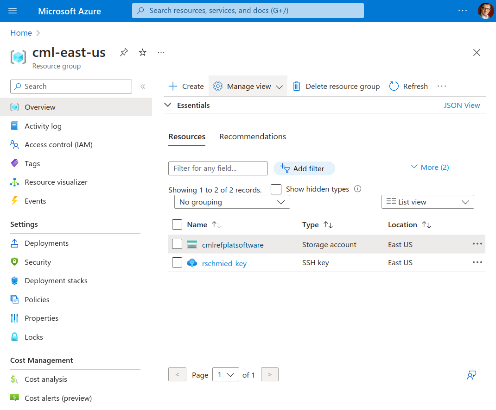
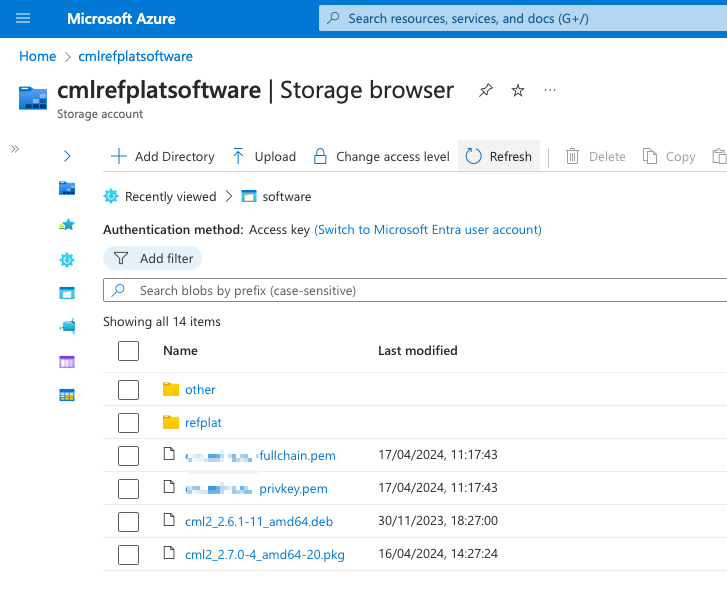

# Azure

This document explains specific configuration steps to deploy a Cisco Modeling Labs (CML) instance in Azure.

## General requirements

The requirements for Azure are mostly identical with those for AWS. Please refer to the AWS document for instructions how to install Terraform. Azure needs the Azure CLI which can be downloaded from [here](https://learn.microsoft.com/en-us/cli/azure/install-azure-cli).

## Authentication

Once the Azure CLI (`az`) has been installed, it is required to log into Azure with an appropriate account.

> [!NOTE]
> It should also be possible to use a service principal with appropriate permissions. However, during the testing/development of the tool chain we did not have access to these resources.

The below shows sample output (`az` has been configured to provide output JSON encoded via `az configure`):

```
$ az login
A web browser has been opened at https://login.microsoftonline.com/organizations/oauth2/v2.0/authorize. Please continue the login in the web browser. If no web browser is available or if the web browser fails to open, use device code flow with `az login --use-device-code`.
[
  {
    "cloudName": "AzureCloud",
    "homeTenantId": "00000000-0000-4000-a000-000000000000",
    "id": "00000000-0000-4000-a000-000000000000",
    "isDefault": true,
    "managedByTenants": [],
    "name": "your-subscription-name",
    "state": "Enabled",
    "tenantId": "00000000-0000-4000-a000-000000000000",
    "user": {
      "name": "user@corp.com",
      "type": "user"
    }
  }
]
```

The provided subscription ID and the tenant ID need to be configured as Terraform variables. This can be done using environment variables and a shell script as shown here using `jq`:

```bash
#!/bin/bash

{ read subID ; read tenantID; } <<< "$(az account list --output=json | jq -r '.[0]|.id,.tenantId')"

export TF_VAR_azure_tenant_id="$tenantID"
export TF_VAR_azure_subscription_id="$subID"
```

The values can be provided directly as well (e.g. copying and pasting them into the script).

## Software

CML software needs to be present on Azure in a storage account / blob container. See the AWS document where to download the `.pkg` file with the Debian packages. The layout of the files inside of the container is otherwise identical to the layout described in the AWS document:

```
"storage_account"
  - "container_name"
    - cml2_2.6.1-11_amd64.deb
    - refplat
      - node-definitions
        - iosv.yaml
        - ...
      - virl-base-images
        - iosv-159-3-m3
        - iosv-159-3-m3.yaml
        - vios-adventerprisek9-m-spa.159-3.m3.qcow2
        - ...
```

Where "storage_accountname" and "container_name" are the names as configured in the `config.yml` file with the same attribute names.

For uploading images / software to Azure, the "azcopy" tool can be used. Please look into [this page](https://learn.microsoft.com/en-us/azure/storage/blobs/storage-quickstart-blobs-cli) for a comprehensive overview on how to "Create, download, and list blobs with Azure CLI".

The items required are:

- create a storage account
- create a "blob service" / container (access level is "private", authentication method is "access key", we could not test with Entra/service principals)
- upload the refplat directory (with the node-definitions and virl-base-images folders) into the container. The azcopy tool provides a "`--recursive`" option
- upload the Debian package into the container

## Compute size

The size of the compute (called "flavor" in AWS) determines the amount of memory and CPU available to the CML instance. The important bit here is the inclusion of the VMX CPU flag to allow for virtualization acceleration. See [this link](https://learn.microsoft.com/en-us/virtualization/hyper-v-on-windows/user-guide/nested-virtualization) for additional information.

The [Ddv4 series](https://learn.microsoft.com/en-us/azure/virtual-machines/ddv4-ddsv4-series) does support nested virtualization and comes in various sizes, as listed in the linked document. We've tested with Standard_D4d_v4 which provides 4 vCPUs and 16GB of memory.

There are other compute series available which will likely also work, please ensure that they do support "Nested virtualization" prior to using them.

## Configuration

In the `config.yml` file, ensure that the `target` attribute at the very top of the file is set to `azure`. Then configure the `storage_account` and `container_name` to match the resources you've created in Azure and where the software has been uploaded (CML debian package, reference platform images).

Ensure that the hostname, disk size and key_name match your requirements and that the SSH public key has been uploaded the resource group on Azure:



Also ensure, that the layout of the software matches the required layout as specified above:



Note in the screenshot above:

- The `refplat` folder has the reference platform images.
- The `cml2_2.7.0-4_amd64-20.pkg` package is stored in the folder. The .deb file is included in the pkg file and is no longer needed separately.
- The `hostname-fullchain.pem` and `hostname-privkey.pem` files contain a certificate/key that, if the hostname part of the filename matches the configured controller hostname, will be installed using the `03-letsencrypt.sh` script.
- Make sure that the `app.software` config value corresponds to the file name of the CML .pkg package in your storage container.

## Running the deployment

The usual `terraform plan` and `terraform apply` sequence can be applied to start the deployment. Depending on the amount of images you want to be available in the resulting VM, this can take anywhere from 5-10 minutes until the VM is deployed, configured and licensed.

Make a note of the IP address and the "delete license" command so that the license is released prior to destroying the CML deployment.

This can be done with `terraform destroy`.

EOF
